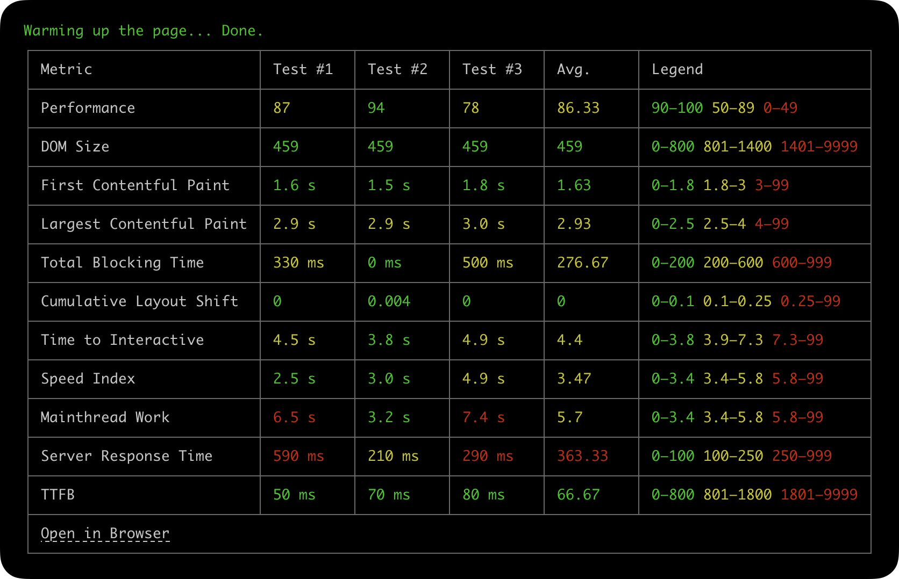

# Lighthouses

Runs Lighthouse against a URL several times and shows the numbers side by side, so a
single unlucky run does not get mistaken for a trend. Built for checking whether a change
to a site actually made it faster.

Each run is throttled (simulated slow network, CPU slowdown) to keep results comparable
between runs and between machines.



## Install

```bash
npm install
npm install -g .
```

That puts a `lighthouses` command on your PATH. Without the global install, use
`node index.js` in place of `lighthouses` below.

## Usage

```bash
lighthouses https://example.com
```

Runs three tests and prints the table. Pass a different count as the second argument:

```bash
lighthouses https://example.com 5
```

The full table appears immediately with empty cells, and fills in as each run finishes. If
the terminal is too short to hold it, the live view is cropped at the top while it runs; the
complete table is printed once at the end.
Values are coloured green / yellow / red against the thresholds shown in the Legend
column, and the last row links to the full Lighthouse HTML reports.

### Options

| Option           | Default | What it does                                                                                                                                                            |
| ---------------- | ------- | ----------------------------------------------------------------------------------------------------------------------------------------------------------------------- |
| `--save`         | off     | Keep this report in its own timestamped folder. Without it, the report overwrites `reports/latest`.                                                                     |
| `--cpu <number>` | `5.2`   | CPU slowdown multiplier. Lower it on a slow machine, raise it to exaggerate main-thread cost.                                                                           |
| `--rand`         | off     | Give every run a unique `?rand=` value, so each one is fetched past the full page cache. The warm-up still requests the plain URL, so PHP and the database stay primed. |

Without `--rand` you are measuring cached renders, which is usually what a visitor gets.
With it you are measuring the uncached path — on a Magento page behind full page cache the
difference in Server Response Time is easily an order of magnitude, so do not compare
numbers taken with the flag against numbers taken without it.

### Reports

HTML reports are written to `reports/` **in the directory you ran the command from** — one
file per run, plus an `index.html` that shows them side by side. The index is rewritten
after every run, so it is readable while the tests are still going.

Remove them all with:

```bash
lighthouses clear
```

## Adding a metric

Everything measured lives in one array in [`src/audits.js`](src/audits.js). Add a row:

```js
{
  title: 'Bootup Time',
  read: lhr => lhr.audits['bootup-time'].displayValue,
  good: [0, 2],
  ok: [2, 3.5],
  poor: [3.5, 99],
},
```

- `read` pulls the value out of a Lighthouse result. Write it plainly — it is called inside
  a `try`, and a throw or a missing value just marks that run as failed and retries it.
- `good` / `ok` / `poor` are inclusive ranges. They colour the value and are printed as the
  legend, so order them to match the metric — most are lower-is-better, but `Performance`
  runs the other way and needs no special flag.
